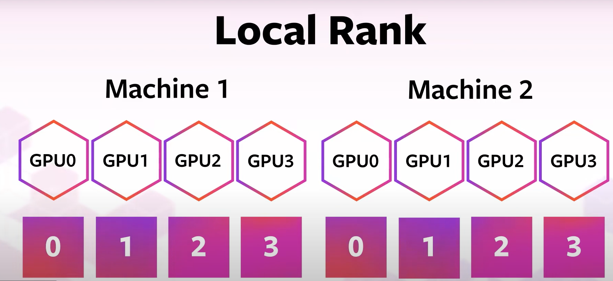

Multi-Node Parallelism
=======================

.. admonition:: Overview
   :class: Overview

    * **Tutorial:** 20 min
    * **Exercises:** 10 min

        **Objectives:**
            #. Learn how to use multiple GPUs, in multiple nodes using Torchrun.

To run the provided code on multiple nodes using torchrun (previously torch.distributed.launch), we need to make a few modifications to the 
single node code:

- **Environment Variables for Multi-Node Training**: Set environment variables like MASTER_ADDR, MASTER_PORT, WORLD_SIZE, and RANK using command-line arguments when launching the script with torchrun.
- **Modifications to the setup function**: The setup function should be updated to handle the environment variables for multi-node training.
- **main function**: Remove the use of mp.spawn and instead rely on torchrun to handle the spawning of processes across nodes.

In PyTorch distributed parallelism, **global rank** and **local rank** are key concepts for managing processes across multiple nodes and
GPUs. The global rank uniquely identifies each process in the entire distributed setup, ranging from `0` to `world_size - 1`, where 
`world_size` is the total number of processes across all nodes. The local rank, on the other hand, identifies each process within a 
specific node, typically corresponding to a particular GPU on that node. The global rank is crucial for tasks that require a unique 
process identity across the system, while the local rank is used for GPU assignment within a node. These ranks are essential for 
ensuring that each process operates correctly within the distributed environment.

Launching a multi-node training involves three key steps:
1. A PBS script is used to allocate the required nodes and execute a shell script on each allocated node.
2. The shell script then invokes the Python program.
3. The Python program initiates the training process.

PBS Script
**********

As Gadi uses the PBS job scheduler we can use it to run the training on multiple nodes. Here we are requesting 2 nodes, each with 4 GPUs.

.. code-block:: console
    :linenos:

    #!/bin/bash

    #PBS -P vp91
    #PBS -q gpuvolta

    #PBS -l ncpus=96
    #PBS -l ngpus=8
    #PBS -l mem=10GB
    #PBS -l walltime=00:20:00 

    #PBS -N multinode

    module load python3/3.11.0  
    module load cuda/12.3.2

    . /scratch/vp91/Training-Venv/pytorch/bin/activate

    # Set variables
    if [[ $PBS_NCPUS -ge $PBS_NCI_NCPUS_PER_NODE ]]
    then
      NNODES=$((PBS_NCPUS / PBS_NCI_NCPUS_PER_NODE))
    else
      NNODES=1
    fi
    
    PROC_PER_NODE=$((PBS_NGPUS / NNODES))
    
    MASTER_ADDR=$(cat $PBS_NODEFILE | head -n 1)
    
    # Launch script
    LAUNCH_SCRIPT=/scratch/vp91/jxj900/intro-to-pytorch/job_scripts/multinode_torchrun.sh
    
    # Set execute permission
    chmod u+x ${LAUNCH_SCRIPT}
    
    # Run PyTorch application
    for inode in $(seq 1 $PBS_NCI_NCPUS_PER_NODE $PBS_NCPUS); do
        echo $inode
        pbsdsh -n $inode ${LAUNCH_SCRIPT} ${NNODES} ${PROC_PER_NODE} ${MASTER_ADDR} &
    done

    wait

.. admonition:: Explanation
   :class: attention

    `MASTER_ADDR`: The IP address or hostname of the master node, which is typically the first node allocated by PBS.
    `PROC_PER_NODE`: The number of GPUs per node.
    `NNODES`: The total number of nodes.

Here, `pbsdsh` launches the `multinode_torchrun.sh` script simultaneously on all nodes. 

.. admonition:: Explanation
    - `pbsdsh`: This command is part of PBS and allows a job to execute commands on a distributed set of nodes allocated by the scheduler. It enables running commands or scripts across multiple nodes in parallel.
    - `-n $inode`: This specifies the target node for the command or script to be executed on. Here, $inode is a variable that refers to the specific node number or index assigned by the PBS scheduler. Each node in a distributed job is identified by a unique number, and pbsdsh -n ensures the command runs on the node corresponding to $inode.
    - `${LAUNCH_SCRIPT}`: This is the script or command that will be executed on each node. ${LAUNCH_SCRIPT} is a placeholder for the actual script name, which likely contains commands to start the distributed processes on each node.

    The following values are passed to the script multinode_torchrun.sh
    - `${NNODES}`: This variable holds the number of total nodes involved in the job. This is passed as an argument to the LAUNCH_SCRIPT, so that the script knows how many nodes are available for the job.
    - `${PROC_PER_NODE}`: This variable indicates the number of processes per node that should be launched. In a distributed setting, this is typically set to the number of GPUs or CPU cores to utilize per node.
    - `${MASTER_ADDR}`: This variable is the address of the master node or rank 0 process, which is responsible for coordinating the distributed processes (especially important in PyTorch or MPI-based distributed training). This address is passed to the script so that worker nodes can connect to the master node

Shell Script
************

The `multinode_torchrun.sh` script contains the following:

.. code-block:: console
    :linenos:

    #!/bin/bash

    # Load shell environment variables
    source ~/.bashrc

    module load python3/3.11.0  
    module load cuda/12.3.2

    . /scratch/vp91/Training-Venv/pytorch/bin/activate
    
    # Application script
    APPLICATION_SCRIPT=/scratch/vp91/jxj900/intro-to-pytorch/src/multinode_torchrun.py
    
    # Set execute permission
    chmod u+x ${APPLICATION_SCRIPT}
    
    # Run PyTorch application
    torchrun --nnodes=${1} --nproc_per_node=${2} --rdzv_id=100 --rdzv_backend=c10d --rdzv_endpoint=${3}:29400 ${APPLICATION_SCRIPT}

Where `torchrun` will launch the training program `distributed_data_parallel.py` on each node and
use all the 4 GPUs on each node.

.. important::
    When using torchrun (the recommended utility for launching distributed training in PyTorch), the 
    values for environment variables LOCAL_RANK, RANK, and WORLD_SIZE are automatically set by are set by
    PyTorch and passed to each process.

.. admonition:: Explanation
   :class: attention

    The rendezvous backend in PyTorch is a key component of the distributed training setup. It is
    responsible for coordinating the initialization of multiple processes that may be running across different 
    nodes in a distributed system. This process is crucial for ensuring that all distributed processes are aware 
    of each other and can start training in a synchronized manner.

    - `rdzv_backend`: The backend used for the rendezvous process (c10d is default for PyTorch).
    - `rdzv_endpoint`: The network address of the rendezvous server, combining `MASTER_ADDR` and `MASTER_PORT`.
    - `rdzv_id` : A unique identifier for the rendezvous session that will coordinate the distributed processes. This is helpful when multiple distributed training jobs are running on the same cluster/network, as it ensures that different jobs are kept separate from each other

Alternative Options
********************

Alternatively, if you can SSH into the individual nodes, you can proceed with the following steps.

On the first node (rank 0):

.. code-block:: console
    :linenos:

    torchrun --nnodes=2 --nproc_per_node=4 --node_rank=0 --master_addr="<Node1 IP>" --master_port=12355 /scratch/vp91/$USER/intro-to-pytorch/src/multinode_torchrun.py

On the second node (rank 1):

.. code-block:: console
    :linenos:

    torchrun --nnodes=2 --nproc_per_node=4 --node_rank=1 --master_addr="<Node1 IP>" --master_port=12355 /scratch/vp91/$USER/intro-to-pytorch/src/multinode_torchrun.py

Of course, this becomes be a very difficult task if you have large number of Nodes.

.. admonition:: Explanation
   :class: attention

   If you have a `SLURM scheduler <https://youtu.be/KaAJtI1T2x4>`_, things are a bit easier since the *srun* command can launch the Torchrun directly 
   from the job script, on all nodes, eliminating the need for an additional shell script.

.. admonition:: Exercise
   :class: todo

    1. Examine the program *src/ multinode_torchrun.py*. What are the changes from *src/distributed_data_parallel.py*?
    2. Examine the job script *job_scripts/multinode_torchrun.pbs*. Can you simplify it?
    3. Examine the job script *job_scripts/multinode_torchrun.sh*. Can you simplify it?
    4. Run the program using the job script *job_scripts/multinode_torchrun.pbs*.

    .. code-block:: console
        :linenos:

        cd job_scripts
        qsub multinode_torchrun.pbs

.. admonition:: Key Points
   :class: hint

    #. We can use Torchrun to use multiple GPUs in multiple nodes.
    #. We can use PBS script to launch multi-node trainings.