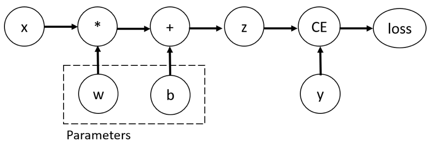

Tensors in PyTorch
===================

.. admonition:: Overview
   :class: Overview

    * **Tutorial:** 20 min
    * **Exercises:** 15 min

        **Objectives:**
            #. Learn about tensors.
            #. Learn the differences between a tensor and NumPy array.
            #. Learn how to move tensors to GPUs.

Tensors are specialized data structures used in PyTorch to represent model inputs, outputs, and parameters. While they are conceptually similar to 
arrays and matrices, they offer additional features such as support for hardware accelerators like GPUs and 
automatic differentiation.

Creating a Tensor
*****************

A tensor can be created in multiple ways:

1. Directly from data

.. code-block:: python
    :linenos:

    data = [[1, 2],[3, 4]]
    x_tensor= torch.tensor(data)

2. From NumPy

.. code-block:: python
    :linenos:

    x_np = np.array(data)
    x_tensor = torch.from_numpy(x_np)

3. From another Tensor

.. code-block:: python
    :linenos:

    x_tensor = torch.ones_like(x_tensor)
    y_tensor = torch.rand_like(x_tensor, dtype=torch.float) 

.. admonition:: Explanation
   :class: attention

   **torch.rand_like()** returns a tensor with the same size as input that but filled with random numbers 
   from the interval [0,1).

Operations on Tensors
*********************

Tensors can perform almost all operations a NumPy array can perform

1.  indexing and slicing

.. code-block:: python
    :linenos:

    x_tensor = torch.ones(4, 4)
    print(f"First row: {x_tensor[0]}")
    print(f"First column: {x_tensor[:, 0]}")
    print(f"Last column: {x_tensor[..., -1]}")
    x_tensor[:,1] = 0
    print(x_tensor)

2. Concatenate multiple tensors

.. code-block:: python
    :linenos:

    y_tensor = torch.cat([x_tensor, x_tensor, x_tensor], dim=1)
    print(y_tensor)

3. Arithmetic Operations

.. code-block:: python
    :linenos:

    x_tensor = torch.ones(4, 4)

    # Transpose
    x_T_tensor = x_tensor.T

    # Matrix Multiplication
    y1_tensor = x_tensor @ x_tensor.T
    y2_tensor = x_tensor.matmul(x_tensor.T)

    y3_tensor = torch.rand_like(y1_tensor)
    torch.matmul(x_tensor, x_tensor.T, out=y3_tensor)

    # Element-wise multiplication
    z1_tensor = x_tensor * x_tensor
    z2_tensor = x_tensor.mul(x_tensor)

    z3_tensor = torch.rand_like(x_tensor)
    torch.mul(x_tensor, x_tensor, out=z3_tensor)

3. In-place Operations

.. code-block:: python
    :linenos:

    x_tensor = torch.ones(4, 4)

    # Transpose
    x_tensor.t_()

    # Copy
    y_tensor = torch.rand_like(x_tensor)
    x_tensor.copy_(y_tensor)

NumPy and Tensor
****************

Tensors on the **CPU** and NumPy arrays can share memory locations, so modifying one will also affect 
the other.

.. code-block:: python
    :linenos:

    x_tensor = torch.ones(5) 
    x_np = x_tensor.numpy() # tensor to numpy
    print(f"t: {x_tensor}")
    print(f"n: {x_np}")

    x_tensor.add_(1)

    print(f"t: {x_tensor}")
    print(f"n: {x_np}")

    y_np = np.ones(5)
    z_np = np.zeros(5)
    y_tensor = torch.from_numpy(y_np) # numpy to tensor

    np.add(y_np, 1, out=z_np)

    np.add(y_np, 1, out=n)

    print(f"t: {x_tensor}")
    print(f"n: {x_np}")

Moving Tensor to GPU
*********************

It's always wise to check for GPU availability before performing any GPU operations. If a GPU is available,
we can move our tensor to it.

.. code-block:: python
    :linenos:

    x_tensor_gpu = x_tensor.to("cuda")

A better approach is to set the default device before starting any computations.

.. code-block:: python
    :linenos:

    device = torch.device("cuda") if torch.cuda.is_available() else torch.device("cpu")
    y_tensor_gpu = y_tensor.to(device)
    
This way, your code will work regardless of whether a GPU is available or not.

Tensor Attributes
*****************

.. code-block:: python
    :linenos:

    print(f"Shape of tensor: {y_tensor.shape}")
    print(f"Datatype of tensor: {y_tensor.dtype}")
    print(f"Device tensor is stored on: {y_tensor.device}")

*Automatic differentiation* is a key feature that distinguishes tensors from NumPy arrays. This capability
is particularly useful in neural networks, where model weights are adjusted during backpropagation based 
on the gradient of the loss function with respect to each parameter. Tensors support automatic gradient 
computation for any computational graph. For example, consider the computational graph of a one-layer 
neural network:

In this context, **w** and **b** are the parameters that need to be optimized. Therefore, we compute 
the gradients of the loss function with respect to these variables.

.. math::

    z = x * w + b

    g1 = \frac{\partial loss}{\partial w} 

    g2 = \frac{\partial loss}{\partial b} 

Tensors make this process quite straightforward:

.. code-block:: python
    :linenos:

    x_tensor = torch.ones(5)  # input tensor
    y_tensor = torch.zeros(3)  # expected output

    w_tensor = torch.randn(5, 3, requires_grad=True)
    b_tensor = torch.randn(3, requires_grad=True)

    z_tensor = torch.matmul(x_tensor, w_tensor) + b_tensor

    loss_tensor = torch.nn.functional.binary_cross_entropy_with_logits(z_tensor, y_tensor)
    loss_tensor.backward()

    print(w_tensor.grad)
    print(b_tensor.grad)

.. admonition:: Exercise
   :class: todo

    Try the notebook *tensors.ipynb*.

.. admonition:: Key Points
   :class: hint

    #. Tensors in PyTorch can be created using various methods.
    #. Moving tensors to GPUs can be done in a device-agnostic manner.
    #. Automatic differentiation is straightforward with tensors in PyTorch.

