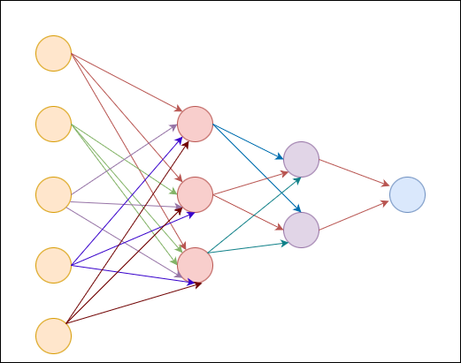
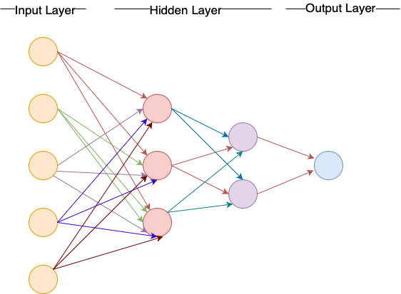

What is a Neural Network?
=========================

.. admonition:: Overview
   :class: Overview

    * **Tutorial:** 60 min
    * **Exercises:** 0 min

        **Objectives:**
            #. Learn the different parts of a neural network.
            #. Learn the theory behind the neural network.

Neural Networks (NN) are computational models inspired by the human brain, designed to recognize patterns and make data-based decisions. 
They consist of interconnected layers of nodes, or "neurons," which process and transform input information. Through training, neural networks 
learn to improve their accuracy in tasks like image recognition, language processing, and more.

Neuron
******

In the context of a neural network, a neuron is a fundamental unit that processes inputs to produce an 
output. Let's break down its role and functionality step by step:

1. **Input features**: These are the individual measurable properties or characteristics of the data that are fed into the network. Features can be any numerical data -
for example if we use image as the input, the input features will be the pixel values of the image. 

.. math::
      
      x^{(1)} = \begin{bmatrix}
              x_{1}\\
              x_{2}\\
              x_{3}\\ 
              .    \\
              .    \\
              x_{n}
          \end{bmatrix}

1. **Weights**: Input features are each associated with a weight, which is a numerical value that adjusts 
the importance of the corresponding input feature. 

.. math::
      
      w^{(1)} = \begin{bmatrix}
              w_{1}\\
              w_{2}\\
              w_{3}\\ 
              .    \\
              .    \\
              w_{n}
          \end{bmatrix}

2. **Calculating the Weighted Sum**: For each neuron, you first multiply each input feature by its corresponding weight. Then, you sum up all these weighted inputs. 
This sum represents the combined influence of all the input feature on the neuron.

.. math::
      
   sum = w_{1} \times x_{1} + w_{2} \times x_{2} + w_{3} \times x_{3} + . . . . +   w_{n} \times x_{n}

3. **Adding Bias**: To this weighted sum, you add a bias term. The bias is another adjustable parameter that helps the neuron model more complex patterns 
by shifting the activation function's input.

.. math::
      
   z = sum + b

4. **Activation Function**: Finally, you apply an activation function to the resulting value (the weighted sum plus bias). The activation function introduces
non-linearity into the neuron's output, which allows the network to learn and represent more complex patterns and relationships.

.. math::
      
   a_{output} = f(z)

In summary, a neuron in a neural network processes its inputs through a series of multiplication, summation, bias addition, and activation 
function application—to produce an output value. This output is then used in further computations within the network or as the final prediction, depending 
on the network's structure.

Activation Function
********************

Activation functions are crucial components of neural networks, performing several key roles that 
influence the network's ability to learn and make predictions. 

Role of Activation Functions:

1. **Produce Outputs of Neurons**: After computing the weighted sum of inputs and adding the bias, an activation function is applied to 
   this value. 

2. **Update Weights and Biases During Training**: Activation functions play a role in updating weights and biases during the *training process*. When the 
   network is trained using methods like *backpropagation*, the *gradient* of the *loss function* with respect to the weights and biases is calculated. 
   The gradient depends on the *derivative* of the activation function, which helps adjust weights and biases to minimize the *error*. Therefore, the choice of 
   activation function affects how effectively the network learns.

Characteristics of Activation Functions:

1. **Scale and Normalize Outputs**:
   Activation functions often scale and normalize the neuron's output. 
2. **Introduce Non-Linearity**:
   Activation functions introduce non-linearity into the network. Without non-linearity, even a multi-layer network would behave like a single-layer network, 
   as linear combinations of linear functions are still linear. Non-linearity allows the network to learn and model complex patterns 
   and relationships in the data.

3. **Define Range of Outputs**: It defines the minumun and maximum value of the network output. For instance, The sigmoid activation function outputs values 
   between 0 and 1. It is defined as :math:`\sigma(x) = \frac{1}{1 + e^{-x}}`. 
   
4. **Simple Derivatives**:
   Most activation functions have simple derivatives, which makes them computationally efficient during the training process. 
   The derivative of the **ReLU** (Rectified Linear Unit) function, which is :math:`\max(0, x)`.

Neural Network -  A Network of Neurons
**************************************

A neural network is a complex system of interconnected neurons organized into layers. Each layer's output serves as the input for the next layer, 
creating a stack of neurons that processes data in stages. Mathematically this can be boiled down to a sophisticated function that maps inputs to outputs 
through numerous parameters. Training involves adjusting these parameters to improve the network's performance and accuracy.

A neural network consists of three types of layers: input, hidden, and output. The input layer receives and holds raw data, with each neuron representing a 
feature of the data. Hidden layers process this data by applying weights, biases, and activation functions to extract and learn complex patterns. These layers 
transform the data and pass it to the next layer in the network. The output layer produces the final prediction or classification result based on the 
processed information from the hidden layers. Each layer plays a crucial role in enabling the network to learn from and make accurate predictions on the data.

.. admonition:: Explanation
   :class: attention

   Matrix X represents the input matrix, where each column vector corresponds to an input sample. So if the matrix has the dimensions :math:`n \times m`
   *n* will be the number of featues in each input sample and *m* will the total number of samples (also called training data). 

   .. math::
      
      X = \begin{bmatrix}
              x_{1}^{(1)} & x_{1}^{(2)}  & x_{1}^{(3)} & .... & x_{1}^{(m)} \\
              x_{2}^{(1)} & x_{2}^{(2)}  & x_{3}^{(3)} & .... & x_{2}^{(m)} \\
              x_{3}^{(1)} & x_{3}^{(2)}  & x_{3}^{(3)} & .... & x_{3}^{(m)} \\ 
              .           & .            & .           & .... & .           \\
              .           & .            & .           & .... & .           \\
              x_{n}^{(1)} & x_{n}^{(2)}  & x_{n}^{(3)} & .... & x_{n}^{(m)} 
          \end{bmatrix}

   :math:`X^{(1)}` will represent the entire vector n x 1 vector representing first input sample while 
   :math:`x_{3}^{(1)}` will represent the third feature in first input sample.

   The figure below illustrates a 2-layer neural network where a single input sample (with 3 features) is provided as input.
   The input layer is not counted as one of the layers.

   .. image:: ../figs/2layer_NN.drawio.png

   Each hidden layer produces activations: in this example, layer 1 has 3 activations, while layer 2 has only one activation.

   .. math::
      a^{[1]} = \begin{bmatrix}
              a_{1}^{[1]} \\
              a_{2}^{[1]} \\
              a_{3}^{[1]} 
          \end{bmatrix}

   .. math::
      a^{[2]} = a_{1}^{[2]}
      
   The number in square brackets represents the layer number, while the subscript denotes the neuron's index within that layer.

   Each neuron in every layer computes the *Z* value for each input sample and then calculates the activation value for that sample. 
   
   The figure illustrates this process with an example of the first neuron in layer 1 processing the first input sample.

   .. image:: ../figs/activation.drawio.png

   In this situation if :math:`W_{1}^{[1]}` is 

   .. math::

      W_{1}^{[1]} = \begin{bmatrix}
                     10.0 \\
                     20.0 \\
                     30.0 
                  \end{bmatrix}

   then :math:`W_{1}^{[1]T}` becomes

   .. math::
      W_{1}^{[1]} = \begin{bmatrix}
                     10.0 & 20.0 & 30.0
                  \end{bmatrix}

   and if :math:`X^{(1)}` is 

   .. math::

      X^{(1)} = \begin{bmatrix}
                     0.3 \\
                     0.2 \\
                     0.5 
                  \end{bmatrix}

   and if bias b = 10

   we can calculate :math:`Z_{1}^{[1](1)}` as

   .. math::

      Z_{1}^{[1](1)} = \begin{bmatrix}
                     10.0 & 20.0 & 30.0
                  \end{bmatrix} \times \begin{bmatrix}
                                          0.3 \\
                                          0.2 \\
                                          0.5 
                                       \end{bmatrix} + 10 \\

                  = (10.0* 0.3) +  (20.0 * 0.2) + (30.0 * 0.5) + 10 = 32

   Now if we apply the ReLU activation fuction :math:`max(0, x)` we get the activation as :math:`a_{1}^{[1](1)}`

   .. math::
         max(0, 32) = 32
   
                 
   Similarly, we can calculate the activations for all the neorons in layer 1 for the input sample :math:`X^{(1)}`

   
   .. math::
      
      a_{1}^{[1](1)} = f(Z_{1}^{[1](1)}) = f(W_{1}^{[1]T} \times X^{(1)} + b_{1}^{[1]})

   .. math::

      a_{2}^{[1](1)} = f(Z_{2}^{[1](1)}) = f(W_{2}^{[1]T} \times X^{(1)} + b_{2}^{[1]})

   .. math::

      a_{3}^{[1](1)} = f(Z_{3}^{[1](1)}) = f(W_{3}^{[1]T} \times X^{(1)} + b_{3}^{[1]})

   Where :math:`W_{1}^{[1]T}, W_{2}^{[1]T}, W_{3}^{[1]T}` are transpose of vectors of size :math:`(3 \times 1)`.
   
   The above example demonstrates how this process works for a single neuron within a layer. In practice we can stack the weights of all neuron in a layer 
   into a matrix.

   .. math::

      W = \begin{bmatrix}
            ------ W_{1}^{[1]T} ------- \\  
            ------ W_{2}^{[1]T} ------- \\ 
            ------ W_{3}^{[1]T} ------- 
          \end{bmatrix}
          
   Similarly we can stack the bias of different neuron in a layer

   .. math::

      B = \begin{bmatrix}
               b_{1}^{[1]} \\
               b_{2}^{[1]} \\ 
               b_{3}^{[1]} 
          \end{bmatrix}

   and the operation 

   .. math::

      Z = W^{T} \times X + B 

   corresponds to the calculations

   .. math::
      
      Z^{[1](1)} = \begin{bmatrix}
                  Z_{1}^{[1](1)} \\  
                  Z_{2}^{[1](1)} \\ 
                  Z_{3}^{[1](1)} 
               \end{bmatrix}

   .. math::

            =  \begin{bmatrix}
                  W_{1}^{[1]T} \times X^{(1)} + b_{1}^{[1]} \\  
                  W_{2}^{[1]T} \times X^{(1)} + b_{2}^{[1]} \\ 
                  W_{3}^{[1]T} \times X^{(1)} + b_{3}^{[1]} 
               \end{bmatrix}

        

   and finally we apply the activation function to the above matrix

   .. math::

      a^{[1](1)}  = \begin{bmatrix}
                  f(Z_{1}^{[1](1)}) \\  
                  f(Z_{2}^{[1](1)}) \\ 
                  f(Z_{3}^{[1](1)}) 
               \end{bmatrix}

   .. math::

      = \begin{bmatrix}
                  a_{1}^{[1](1)} \\  
                  a_{2}^{[1](1)} \\ 
                  a_{3}^{[2](1)}  
               \end{bmatrix}
   

   The above example illustrates how a single input sample is processed by a layer with 3 neurons. For *m* input samples and *a* neurons, we can compute the 
   complete activation of the first layer for all samples as follows:

   .. math::
      
      a^{[1]} = \begin{bmatrix}
                  a_{1}^{(1)} & a_{1}^{(2)} & .... & a_{1}^{(m)} \\  
                  a_{2}^{(1)} & a_{2}^{(2)} & .... & a_{2}^{(m)} \\ 
                  a_{3}^{(1)} & a_{3}^{(2)} & .... & a_{3}^{(m)} \\
                  . & . & .... & . \\
                  . & . & .... & . \\
                  a_{a}^{(1)} & a_{a}^{(2)} & .... & a_{a}^{(m)} \\
               \end{bmatrix}

This will involve a GEneral Matrix multiplication (GEMM) operation :math:`W^{[1]T} \times X` where :math:`X` will be the entire input sample 
represented as a matrix of dimensions :math:`n \times m` (where *n* is the number of features in an input sample and *m* is the number of input samples. 
In the above example *n* is 3). :math:`W^{[1]T}` will be a matrix of dimensions :math:`a \times m` (where *a* is the number of input neurons in that layer 
and *m* is the number input samples. The above example *a* is 3). This will result in the output of the first layer represented as the matrix :math:`a^{[1]}` 
and it will have the dimensions :math:`a \times n`. In matrix :math:`a^{[1]}`, the horizontal axis represents the training samples, while the vertical axis 
represents the neurons in a layer.

The matrix :math:`a^{[1]}` holds the value of :math:`a` neurons applied to :math:`m` input samples. This matrix then forms the input to the next layer in the neural network.

We typically initialize the weights of each neuron randomly, although methods like **Xavier Initialization**, **He Initialization**, or 
**Orthogonal Initialization** are commonly used to improve training efficiency. 

               

Loss Function and Cost Functions
********************************

During training, for each batch of input samples, calculations are 
propagated through the network in a process called the **forward pass**. After each forward pass, the weights of the network are updated using 
the **backpropagation** algorithm, which adjusts the weights based on the gradients to minimize error. 

.. important::
   In practice weight updates do not happen after  every individual sample; instead, they occur after each batch of data, depending on the **batch size** used. 

An **epoch** refers to a full pass through the entire training dataset, where the network processes all data samples, performing forward passes and backpropagation for each batch.

1. The **loss function** (also known as the error function or objective function) measures the error or difference between 
the predicted output of the neural network and the actual target values for a single training example. 
In this tutorial loss function will be denoted as :math:`L(y', y)` where :math:`y'` is the predicted output while :math:`y` is the actual output. 

2. The **cost function** is the average or aggregate of the loss function computed over the entire training dataset. It provides a measure of the 
overall performance of the model across all examples. In this tutorial loss function will be denoted as :math:`J(W, b)` where :math:`w` is weight 
and :math:`b` is biases in the NN.

The network performs the following steps to calculate the cost:

1. Inputs the data.
2. Executes a forward pass to generate the network's output.
3. Computes the error in the output using the loss function. 

In the example of the 2-layer neural network we discussed earlier, the loss calculation would look like this:

.. math::
      
      Z^{[1]} = W^{[1]T} \times X + b^{[1]} \rightarrow a^{[1]} = f(Z^{[1]}) \rightarrow Z^{[2]} = W^{[2]T} \times X + b^{[2]} \rightarrow a^{[2]} = f(Z^{[2]}) \rightarrow L(a^{[2]}, y)

Where the loss :math:`L(y', y)` is

.. math::

   L(y', y) = y' - y = a^{[2]} - y

Since errors can be both positive and negative, we want to ensure they don't cancel each other out. 
Therefore, in the cost function :math:`J(W, b)` we typically use the square of the error or the absolute value to avoid this issue.

.. admonition:: Explanation
   :class: attention

      Mean Squared Error (MSE) is a common cost function.

      .. math::
         
         J(W, b) = \frac{1}{2} \times \sum_{n=1}^{m} (y_{train} - y_{network})^{2} 

Gradient Descent
****************

After computing the cost, we can adjust the weights and biases to minimize the cost in the next epoch. This is done using an optimization algorithm like 
gradient descent. The goal is to iteratively update the values of W (weights) and b (biases) in the direction that reduces the cost function :math:`J(W, b)`.

In gradient descent, we compute the gradient of the cost function with respect to the weights and biases, which tells us the direction of the steepest 
increase in the cost. We then adjust the weights and biases by moving in the opposite direction of this gradient to minimize the cost. The update rule 
is as follows:

.. math::

   w := w - \alpha \times \frac{\partial J(W, b)}{\partial w} \\
   b := w - \alpha \times \frac{\partial J(W, b)}{\partial b}

until we find the optimal values for *w* and *b* that yield the minimum value for :math:`J(W, b)`. Here :math:`\alpha` is the learning rate. 

When selecting a cost function for a neural network, we typically choose a **convex function** because it ensures that there is only a single global 
optimal value, rather than multiple local minima. A **convex function** has the property that any line segment between two points on the function 
lies above or on the graph, meaning it has a **single valley shape**. This guarantees that when we minimize the cost, we are moving toward the global 
minimum, rather than getting stuck in a local minimum. To find this optimal value, we continuously update the model parameters, such as the weights and 
biases, using optimization techniques like gradient descent. This process moves us steadily toward the minimum point of the cost function.

.. admonition:: Explanation
   :class: attention

   The derivatives give you the slope (the direction in which we need to move the parameter values) of the loss function and eventually it moves to the local optimum.

   Suppose we have a function

   .. math::

      J = 3 \times v

   Then the derivative of j with respect to v is

   .. math::

      \frac{\partial J}{\partial v} = 3

   What this means is that if *v* changes by a small value :math:`\delta`, J changes by :math:`3 \times \delta`. For example

   .. math::
         v = 2 \rightarrow J = 6
         v = 2.001 \rightarrow j = 6.003

   In this example when v changes by 0.001 J changes by .003 (:math: `6.003 - 6`).

But how does this approach help when the cost function :math:`J` involves weights and biases across multiple layers in the neural network, rather than just 
a single layer? So we are not dealing with :math:`J(W, b)` but instead :math:`J(W^{[1]}, W^{[1]}, ...., W^{[L]}, b^{[1]}, b^{[2]},...., b^{[L]})`. 
That is where we use the conscept of **Computational graphs**. 

How does this approach help when the cost function :math:`J` involves weights and biases across multiple layers in the neural network, rather than just 
a single layer? In this case, we are dealing with a more complex function, :math:`J(W, b)` but instead :math:`J(W^{[1]}, W^{[1]}, ...., W^{[L]}, b^{[1]}, b^{[2]},...., b^{[L]})`
where :math:`L` represents the number of layers in the network.

This complexity is addressed using the concept of **computational graphs**. A **computational graph** is a directed acyclic graph where each node 
represents an operation (like addition or multiplication) or a variable (such as weights, biases, or activations), and the edges represent the flow of 
data between operations. 

.. admonition:: Explanation
   :class: attention

   Suppose we have a set of computations as follows:

   .. math::

      J(a, b, c) = 3 \times (a + b \times c) \\

   We can rewrite this as:

   .. math::

      u = b \times c 

   .. math::

      v = a + u 

   .. math::

      J = 3 \times v

   We can reprsent this computation as a directed graph where the nodes represent operations and edges represent the flow of data between these operations. 

   .. image:: ../figs/comp_graph.drawio.png

   Then, by traversing the computational graph from right to left, we can determine how changes in parameters in one node affect the cost 
   function :math:`J(a, b c)`.

   If we change the value of *v* how much would the value of *J* change?

   .. math::

      \frac{\partial J}{\partial v} = 3   \; \rightarrow eq(1)

   How does the change in *a* change the value of *J* (chain rule)?

   .. math::

      \frac{\partial J}{\partial a} = \frac{\partial J}{\partial v} \times  \frac{\partial v}{\partial a} \\
      \frac{\partial J}{\partial v} = 3   \; (from \: eq(1)) \\
      \frac{\partial v}{\partial a} = 1 \\

      \frac{\partial J}{\partial a} = 3 \times 1 = 3   \; \rightarrow eq(2)

   How does the change in *u* change the value of *J* (chain rule)?

   .. math::

      \frac{\partial J}{\partial u} = \frac{\partial J}{\partial v} \times  \frac{\partial v}{\partial u} \\
      \frac{\partial J}{\partial v} = 3    \; (from \: eq(1)) \\
      \frac{\partial v}{\partial a} = 1 \\

      \frac{\partial J}{\partial u} = 3 \times 1 = 3  \; \rightarrow eq(3)

   How does the change in *b* change the value of *J* (chain rule)?

   .. math::

      \frac{\partial J}{\partial b} = \frac{\partial J}{\partial u} \times  \frac{\partial u}{\partial b} \\
      \frac{\partial J}{\partial u} = 3  \; (from \: eq(3)) \\
      \frac{\partial u}{\partial b} = c \\

      \frac{\partial J}{\partial u} = 3 \times c = 3c

   How does the change in *c* change the value of *J* (chain rule)?

   .. math::

      \frac{\partial J}{\partial c} = \frac{\partial J}{\partial u} \times  \frac{\partial u}{\partial c} \\
      \frac{\partial J}{\partial u} = 3  \; (from \: eq(3)) \\
      \frac{\partial u}{\partial c} = b \\

      \frac{\partial J}{\partial u} = 3 \times b = 3b

   As seen from above when computing a derivative it is easier to move from the right to left following the computation graph.

Backpropagation
***************

Based on the cost function, we may need to either excite (increase the influence) or inhibit (decrease the influence) certain neurons. To achieve this,
each layer indirectly affects the weights and biases of the preceding layer using the same computational graph concept we discussed earlier. This process 
is known as backpropagation.

So, how does backpropagation connect with computational graphs? Let's examine a brief (and incomplete) Python code snippet that demonstrates how to 
update the final hidden layer using the cost function from the output layer.

.. code-block:: python
   :linenos:

   # forward pass from the last hidden layer to the output layer
   for i in range (1, m):
      Zi = gemm(W, X[:i]) + b # matrix multiplication followed by addition
      ai = f(Zi) # f() is the activation function

      l = L(ai, yi) # L() is the loss function
      J+ = l   # accumulate the loss for each input sample     

   # average over m input samples
   J = J / m 

   # Backpropagation from the output layer to the last hidden layer
   # assuming we have just two neurons in the layer
   dW1 += slope_W1(J, W1) # find the slope (derivative) of the cost function wrt W1
   dW2 += slope_W2(J, W2) # find the slope (derivative) of the cost function wrt W2
   db1 += slope_b1(J, b1) # find the slope (derivative) of the cost function wrt db1
   db2 += slope_b2(J, b2) # find the slope (derivative) of the cost function wrt db2

   # update the weights and biases
   W1 = W1 - alpha * dW1 # alpha is the learning rate
   W2 = W2 - alpha * dW2
   b1 = b1 - alpha * db1 
   b2 = b2 - alpha * db2

Where :math:`dW1 = \frac{\partial J}{\partial W_{1}}`, :math:`dW2 = \frac{\partial J}{\partial W_{2}}`, :math:`db1 = \frac{\partial J}{\partial b_{1}}` and :math:`db2 = \frac{\partial J}{\partial b_{2}}`. 

.. important::
   In practice, we will replace the for loop with a vectorized implementation to improve efficiency.

Convergence
***************

Finally, we stop the training when the network converges. In the context of neural networks, convergence refers to the point where the training process 
stabilizes, and the performance metrics (such as the cost function) cease to improve significantly or become consistent.

.. admonition:: Key Points
   :class: hint

      #. At its core, a neural network performs general matrix-matrix operations (GEMM).
      #. After each epoch, weights are adjusted to recalibrate the network.
      #. The more data you have, the more effective this recalibration becomes (brute force approach).